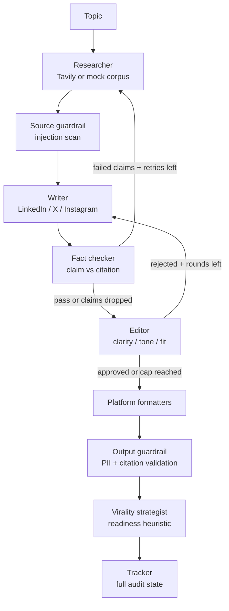

# ThreadForge

### Evidence-aware, multi-agent content generation for LinkedIn, X, and Instagram

ThreadForge is a stateful [LangGraph](https://langchain-ai.github.io/langgraph/) workflow that turns a topic into platform-native social content backed by research citations.

It combines:

- source research with Tavily and a deterministic offline corpus;
- cited drafting with Groq or a deterministic mock writer;
- independent claim-level fact checking;
- a bounded writer ↔ editor feedback loop;
- source and output guardrails for prompt injection, PII, and citation errors;
- platform-specific formatting and browser previews;
- an evidence-aware viral-potential strategy layer.

> Viral potential is a content-readiness heuristic, not a promise of reach or engagement. The system never adds unsupported claims, fake urgency, or fabricated social proof to make a post look more viral.

[](https://www.python.org/)
[](https://langchain-ai.github.io/langgraph/)
[](https://fastapi.tiangolo.com/)
[](tests/)
[](LICENSE)

## Why this project exists

A single prompt can produce polished-looking copy that contains unsupported claims. ThreadForge treats content generation as a workflow with observable state and recovery paths:

1. Research a topic and normalize source provenance.
2. Scan sources for prompt-injection patterns.
3. Draft one version per selected platform.
4. Check every factual claim against its cited source.
5. Re-research when claims fail, or drop unverifiable claims at the retry cap.
6. Let an editor score clarity, tone, and platform fit.
7. Revise rejected drafts up to three rounds.
8. Format the approved copy for each platform.
9. Re-check PII and citations before publishing the result.
10. Score viral-readiness signals and seal the run in an audit trace.

## Architecture



The LangGraph state preserves the research bundle, stable source IDs, every draft version, claim results, editor critiques, guardrail reports, virality recommendations, telemetry, and the final outputs.

## Platform-native output

| Platform | Output behavior | Preview behavior |
|---|---|---|
| LinkedIn | Short paragraphs, inline citations, professional tone, closing question | LinkedIn-style post card with sources |
| X | Numbered 280-character thread with URL-aware counting | Connected X thread with post numbering and character rings |
| Instagram | Caption capped at 150 words plus 20 generated hashtags | Carousel-style image cards with text inside each slide and caption below |

The Instagram carousel is currently a browser-rendered preview. It does not yet export PNG/JPG assets or publish directly to social networks.

## Quickstart

### 1. Install

```bash
python -m venv .venv

# Windows
.venv\\Scripts\\pip install -r requirements.txt

# macOS / Linux
# .venv/bin/pip install -r requirements.txt
```

### 2. Run offline in mock mode

No API keys are needed for the deterministic demo:

```bash
python -m src.influencer_pipeline "iPhone 17 launch specs and price" --mock
```

### 3. Run the custom web application

The FastAPI process serves both the NDJSON API and the custom frontend:

```bash
uvicorn backend.main:app --host 127.0.0.1 --port 7860
```

Open [http://127.0.0.1:7860](http://127.0.0.1:7860).

Health check:

```text
http://127.0.0.1:7860/api/health
```

### Optional: run the Gradio inspection UI

```bash
python app.py
```

The Gradio UI is useful for inspecting raw platform outputs, sources, fact checks, editor rounds, and metrics. The custom FastAPI frontend is the portfolio-facing experience.

## Configuration

Copy `.env.example` to `.env`. Every key is optional; missing providers fall back independently to deterministic mock behavior.

| Variable | Purpose |
|---|---|
| `GROQ_API_KEY` | Writer and editor LLM calls |
| `TAVILY_API_KEY` | Live web research |
| `GOOGLE_API_KEY` | Optional independent judge provider |
| `LANGSMITH_API_KEY` | Optional LangSmith tracing |
| `WRITER_MODEL` | Writer model override |
| `JUDGE_MODEL` | Judge model override |
| `MOCK_LLM` | Force deterministic offline mode with `1` |
| `API_AUTH_TOKEN` | Optional API authentication for private deployments |
| `CORS_ORIGINS` | Allowed frontend origins |
| `RATE_LIMIT_PER_MINUTE` | Per-host in-process request limit |
| `TRACE_RAW_CONTENT` | Keep raw trace content only when explicitly set to `1` |

For a public deployment, keep `TRACE_RAW_CONTENT=0`, use server-side secrets, and enforce authentication/rate limiting at a shared gateway when running multiple workers.

## API

`POST /api/run` streams newline-delimited JSON events while the graph runs.

```bash
curl -N -X POST http://127.0.0.1:7860/api/run \
  -H "Content-Type: application/json" \
  -d '{
    "topic": "How should teams evaluate AI agents?",
    "platforms": ["linkedin", "twitter", "instagram"]
  }'
```

The stream emits pipeline-step events followed by a final result containing:

- `summary` — fact, editor, guardrail, latency, token, and virality metrics;
- `outputs` — final formatted content per platform;
- `sources` — post-guardrail research sources;
- `claim_results` — citation-level entailment decisions;
- `editor_critiques` — round-by-round style feedback;
- `virality` — platform-specific readiness score, angle, dimensions, and recommendations;
- `log` — the audit trail for the run.

## Evaluation

The repository includes a deterministic 20-topic benchmark and a prompt-injection suite. These results measure routing, formatting, and guardrail plumbing; mock-mode numbers are not claims of real-world factual accuracy.

| Configuration | Fact pass | Editor reject curve | Style score: L / X / IG | Tokens per run |
|---|---:|---:|---:|---:|
| Single-prompt baseline | 83.3% | — | 3.7 / 3.7 / 3.7 | 763 |
| ThreadForge workflow | 100.0% | 100% → 0% | 5.0 / 5.0 / 5.0 | 3,225 |

Additional measured checks:

- 13/13 prompt-injection examples blocked with 0 false positives in the guardrail suite.
- Fact-check retry loop exercised across the 20-topic mock benchmark.
- 34/34 automated tests pass.

Run the benchmark yourself:

```bash
python scripts/evaluate.py --mock
```

Live metrics should be regenerated with a versioned source set, model versions, judge coverage, and run date before being used as production claims.

## Testing

```bash
python -m pytest -q
```

The test suite covers:

- end-to-end LangGraph routing;
- fact-check and editor feedback loops;
- citation and PII guardrails;
- stable source provenance through retries and quarantine;
- LinkedIn, X, and Instagram formatter limits;
- virality strategy scoring and safety guidance;
- privacy-conscious trace behavior.


## Repository layout

```text
src/influencer_pipeline/
  researcher.py             Tavily, cache, and mock research
  writer.py                 cited drafts and revision feedback
  fact_checker.py           claim-to-source entailment scoring
  editor.py                 clarity, tone, and platform-fit review
  virality.py               deterministic viral-readiness strategy
  formatter.py              platform output assembly
  formatters/               LinkedIn, X, and Instagram limits
  guardrail.py              injection, PII, and citation checks
  graph.py                  LangGraph state machine and loops
  tracker.py                metrics and privacy-conscious traces

backend/main.py             FastAPI NDJSON API and static hosting
frontend/                   custom platform-native preview UI
app.py                      optional Gradio inspection UI
scripts/evaluate.py         20-topic benchmark and baseline comparison
reports/                    evaluation report and local audit artifacts
data/                       topics, mock sources, and adversarial cases
tests/                      34 unit, integration, and end-to-end tests
Dockerfile                  single-service deployment image
vercel.json                 optional static frontend deployment config
```

## License

Released under the [MIT License](LICENSE).
